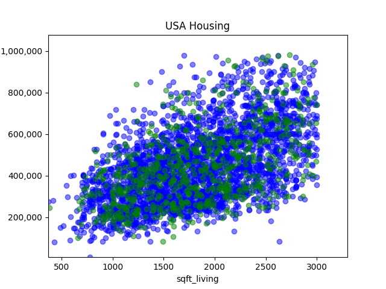

# implementacion_ML_sin_framework

Implementación de una técnica de aprendizaje máquina sin el uso de un framework. (Portafolio Implementación)

## Descripción
Este proyecto es una implementación básica de un modelo de regresión lineal para predecir el precio de viviendas en los Estados Unidos. Se utiliza un conjunto de datos que contiene información sobre casas en los Estados Unidos. Por el momento este modelo solo se enfoca en las variables `sqft_living` y `price`, se descartan las demás features.

La implementación está hecha completamente desde cero en Python, sin el uso de bibliotecas de machine learning avanzadas. El código incluye funciones para la limpieza de datos, normalización, entrenamiento del modelo, predicción y una pequeña evaluación del rendimiento.

## Descripción de los datos
Los datos utilizados provienen de [Kaggle](https://www.kaggle.com/code/engelhernndezgonzlez/usa-house-price-eda](https://www.kaggle.com/datasets/fratzcan/usa-house-prices). El dataset incluye 18 variables en total, contiene instancias en las que no se hizo el cálculo del precio (`price = 0`) y los datos tienen outliers muy marcados. Además, por la cantidad de de datos que hay en el dataset y para tener un programa más rápido y eficiente se utilizarán solo las casas que tienen un área cuadrada que va de 0 a 3000.

## Bibliotecas necesarias
Para ejecutar este proyecto, se requieren las siguientes bibliotecas de Python:

- `pandas`
- `numpy`
- `matplotlib`

## Cómo correrlo en la terminal
1. Asegúrate de tener Python instalado en tu sistema.
2. Instala las bibliotecas necesarias usando pip:
    ```bash
    pip install pandas numpy matplotlib
    ```
3. Coloca los archivos CSV del dataset en la carpeta `./data/`.
4. Ejecuta el script principal desde la terminal:
    ```bash
    python main.py
    ```
5. Durante la ejecución, el programa te pedirá si deseas utilizar datos precalculados o randomizar los datos de entrenamiento y prueba.

## Resultados de los datos precalculados

### 1. Distribución de los Datos de Entrenamiento y Prueba

Se realizó una visualización de los datos utilizados para el entrenamiento y la prueba del modelo de regresión lineal. Los datos de entrenamiento se muestran en azul y los datos de prueba en verde.



### 2. Progreso del Entrenamiento del Modelo

Durante el entrenamiento, el modelo ajustó los parámetros `w` y `b` para minimizar la función de costo. Debido a los altos precios que se manejaban, se normalizaron los datos y posteriormente fue la línea la que se ajusto a como se vería ya con los datos originales, esto con el objetivo de tener un desempeño más rápido y eficaz. El objetivo que se buscaba con el modelo era realizar epochs hasta que la diferencia entre el epoch actual y pasado diera un costo cuya diferencia fuera menor a 0.0001, ya que a partir de aquí seguir haciendo epochs no será muy útil. 

A continuación, se muestra una gráfica que representa el modelo en el último `epoch`, donde se puede observar la línea de regresión ajustada sobre los datos de entrenamiento.


### 3. Predicciones en los Datos de Prueba

Una vez entrenado el modelo, se realizaron predicciones sobre el conjunto de prueba. En la gráfica siguiente, se puede observar la comparación entre los valores reales de los precios de las casas (en verde) y las predicciones realizadas por el modelo (en rojo).


### 4. Resumen del Desempeño

El modelo fue entrenado utilizando un 80% de los datos y se evaluó en el 20% restante. A continuación se presenta un resumen del error cuadrático medio (MSE) tanto en el entrenamiento como en la prueba:

- **Error cuadrático medio del entrenamiento**: 23209547361.58
- **Error cuadrático medio de la predicción**: 23311569561.82
- **Porcentaje de error de la predicción con base en el entrenamiento**: 0.44%

Las 5 predicciones más cercanas a la realidad fueron las siguientes:

|    Predicción   |    Realidad   |
|-----------------|---------------|
| $333657.84      | $334000.00    |
| $370378.23      | $370000.00    |
| $505576.03      | $506000.00    |
| $530612.67      | $530000.00    |
| $595707.91      | $594950.00    |

Las 5 predicciones más alejadas a la realidad fueron las siguientes:

|    Predicción   |    Realidad   |
|-----------------|---------------|
| $347010.70      | $839000.00    |
| $497230.49      | $955500.00    |
| $508914.25      | $930000.00    |
| $507245.14      | $925000.00    |
| $395414.86      | $810000.00    |


## Conclusión
Aunque observamos que la línea de regresión se ajusta a los datos, el error resultante es considerablemente grande. Esto indica que el modelo lineal simple puede no ser suficiente para capturar la complejidad de los datos. Para mejorar el modelo, sería útil considerar la inclusión de más características (features) relevantes que puedan influir en el precio de las casas, como la ubicación, el número de pisos, la vista, y la antigüedad del edificio. Además, podríamos explorar modelos más complejos, como la regresión polinomial o incluso modelos no lineales como árboles de decisión o redes neuronales, que podrían ofrecer una mejor capacidad predictiva al capturar relaciones más complejas entre las variables. Esto lo establezco como opciones para realizar un modelo con estos mismos datos en un futuro y que tenga resultados más adecuados y parecidos a la realidad.
